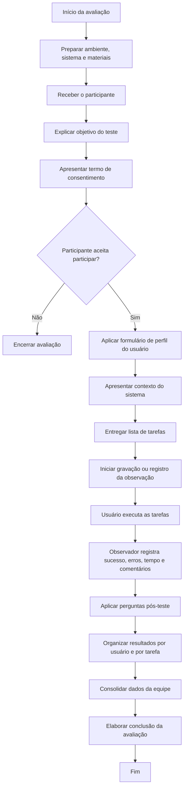

# Aula 14 — Avaliação de Usabilidade por Observação do Usuário

## 1. Método de Avaliação de Usabilidade por Observação do Usuário

O método utilizado será a **avaliação de usabilidade por observação do usuário**, na qual os participantes utilizam o sistema enquanto a equipe observa suas ações, dificuldades, dúvidas, erros e comentários durante a execução de tarefas previamente definidas.

Esse método permite coletar dados sobre situações reais de uso, identificando problemas enfrentados pelos usuários durante a interação com o sistema. A avaliação será feita com base no desempenho dos participantes nas tarefas e também em suas opiniões e sentimentos após a experiência de uso.

Cada membro da equipe ficará responsável por observar um usuário, conforme definido no enunciado da atividade.

---

## 2. Fluxograma de Avaliação de Usabilidade por Observação do Usuário

---

## 3. Descrição do Procedimento de Preparação do Teste

### Passo 1 — Definir o objetivo do teste

O objetivo do teste é avaliar a usabilidade do **Goriah**, observando se os usuários conseguem compreender a proposta da plataforma, navegar pelo sistema e realizar tarefas principais sem dificuldades significativas.

A avaliação busca identificar problemas de interação, dúvidas, erros, pontos positivos e oportunidades de melhoria na interface.

---

### Passo 2 — Definir a lista de tarefas que o usuário deve cumprir

As tarefas foram definidas considerando funcionalidades importantes do sistema e situações próximas ao uso real da plataforma.

| Nº | Tarefa | Objetivo da tarefa |
|---|---|---|
| 1 | Acessar o sistema e observar a tela inicial/feed. | Verificar se o usuário entende a proposta inicial da plataforma. |
| 2 | Localizar uma publicação de interesse no feed. | Avaliar se o usuário consegue navegar e encontrar conteúdos relevantes. |
| 3 | Utilizar filtros, tags ou busca para encontrar um tema específico. | Verificar se o usuário compreende os mecanismos de organização e busca. |
| 4 | Interagir com uma publicação, como abrir, comentar ou reagir. | Avaliar a facilidade de interação social e acadêmica dentro da plataforma. |
| 5 | Criar uma nova publicação. | Verificar se o usuário compreende o fluxo de criação de conteúdo. |
| 6 | Acessar notificações, perfil ou conexões. | Avaliar se o usuário consegue localizar funcionalidades secundárias importantes. |

---

### Passo 3 — Preparar o formulário de perfil do usuário

O formulário de perfil será utilizado para conhecer minimamente o participante e compreender seu contexto de uso.

| Pergunta | Resposta |
|---|---|
| Nome ou identificação do participante |  |
| Idade |  |
| Curso ou área de formação |  |
| Semestre/período |  |
| Frequência de uso de redes sociais ou plataformas acadêmicas |  |
| Familiaridade com sistemas web | Baixa / Média / Alta |
| Já utilizou alguma plataforma parecida? | Sim / Não |
| Dispositivo utilizado no teste | Computador / Celular / Tablet |

---

### Passo 4 — Preparar o cenário de uso

Antes de iniciar as tarefas, o participante receberá um breve contexto:

> Imagine que você é estudante universitário e deseja usar uma plataforma acadêmica para encontrar publicações, interagir com outros estudantes, acompanhar conteúdos de interesse e compartilhar dúvidas ou oportunidades.
>
> Durante o teste, utilize o sistema da forma mais natural possível. O objetivo não é avaliar você, mas sim entender se a interface do sistema está clara, fácil de usar e adequada para os usuários.

---

### Passo 5 — Preparar a planilha de observação

Durante a execução das tarefas, o observador deverá registrar:

- se a tarefa foi concluída;
- quantidade de erros cometidos;
- tipos de erros;
- tempo necessário;
- grau de satisfação;
- comentários espontâneos;
- observações sobre dúvidas, hesitações ou dificuldades.

---

### Passo 6 — Preparar ambiente, gravação e materiais

A equipe deverá preparar:

- sistema ou protótipo funcional;
- computador ou celular para o participante;
- formulário de perfil;
- lista de tarefas;
- planilha de observação;
- cronômetro;
- ferramenta de gravação de tela ou vídeo;
- link para registro das respostas;
- termo de consentimento, se necessário.

Durante a execução, o avaliador não deve ajudar o usuário na realização das tarefas. O papel do avaliador é observar, registrar os problemas e ouvir os comentários do participante, sem explicar como a tarefa deve ser feita.

---

## 4. Execução do Teste

Cada usuário será observado individualmente durante o uso do sistema. A equipe deverá apresentar o contexto, entregar as tarefas e acompanhar a execução sem interferir diretamente.

O observador poderá ouvir os comentários do usuário, mas não deverá explicar como realizar as tarefas. Caso o participante fique em dúvida, essa dificuldade deverá ser registrada como dado da avaliação.

Após a conclusão das tarefas, será aplicado um pequeno questionário ou entrevista pós-teste para compreender a percepção do usuário sobre a experiência.

---

## 5. Resultados do Teste

### 5.1 Avaliação de cada tarefa por usuário

#### Usuário 1 — [Nome ou identificação]

| Tarefa | Grau de Sucesso | Total de Erros cometidos | Tipos de Erros | Tempo Necessário | Grau de Satisfação |
|---|---|---:|---|---|---|
| 1 |  |  |  |  |  |
| 2 |  |  |  |  |  |
| 3 |  |  |  |  |  |
| 4 |  |  |  |  |  |
| 5 |  |  |  |  |  |
| 6 |  |  |  |  |  |

#### Usuário 2 — [Nome ou identificação]

| Tarefa | Grau de Sucesso | Total de Erros cometidos | Tipos de Erros | Tempo Necessário | Grau de Satisfação |
|---|---|---:|---|---|---|
| 1 |  |  |  |  |  |
| 2 |  |  |  |  |  |
| 3 |  |  |  |  |  |
| 4 |  |  |  |  |  |
| 5 |  |  |  |  |  |
| 6 |  |  |  |  |  |

#### Usuário 3 — [Nome ou identificação]

| Tarefa | Grau de Sucesso | Total de Erros cometidos | Tipos de Erros | Tempo Necessário | Grau de Satisfação |
|---|---|---:|---|---|---|
| 1 |  |  |  |  |  |
| 2 |  |  |  |  |  |
| 3 |  |  |  |  |  |
| 4 |  |  |  |  |  |
| 5 |  |  |  |  |  |
| 6 |  |  |  |  |  |

---

## 6. Critérios de Avaliação

### 6.1 Grau de sucesso

| Grau de Sucesso | Descrição |
|---|---|
| **Sucesso** | O usuário concluiu a tarefa sem dificuldade relevante. |
| **Sucesso parcial** | O usuário concluiu a tarefa, mas apresentou dúvidas, erros ou precisou de mais tempo. |
| **Falha** | O usuário não conseguiu concluir a tarefa. |

---

### 6.2 Tipos de erros

| Tipo de Erro | Descrição |
|---|---|
| **Erro de compreensão** | O usuário não entendeu o que deveria fazer ou interpretou a interface de forma incorreta. |
| **Erro de navegação** | O usuário acessou caminhos inadequados ou teve dificuldade para encontrar a funcionalidade. |
| **Erro de ação** | O usuário clicou em opções incorretas ou executou ações diferentes do esperado. |
| **Erro de preenchimento** | O usuário teve dificuldade para preencher campos ou inserir informações. |
| **Erro de recuperação** | O usuário não conseguiu corrigir ou desfazer uma ação realizada. |

---

### 6.3 Grau de satisfação

| Grau de Satisfação | Descrição |
|---|---|
| **Satisfeito** | O usuário demonstrou facilidade e segurança durante a tarefa. |
| **Leve confusão** | O usuário teve pequenas dúvidas, mas concluiu a tarefa sem grande dificuldade. |
| **Confusão moderada** | O usuário demonstrou insegurança, hesitação ou dificuldade perceptível. |
| **Insatisfeito** | O usuário demonstrou frustração ou não conseguiu concluir a tarefa. |

---

## 7. Links dos Vídeos

| Usuário | Link do vídeo |
|---|---|
| Usuário 1 | [Inserir link do vídeo] |
| Usuário 2 | [Inserir link do vídeo] |
| Usuário 3 | [Inserir link do vídeo] |

---

## 8. Respostas do Formulário do Usuário

### Usuário 1 — [Nome ou identificação]

| Pergunta | Resposta |
|---|---|
| O sistema foi fácil de usar? |  |
| O que você achou mais fácil? |  |
| O que você achou mais difícil? |  |
| Alguma informação ficou confusa? |  |
| O que você mudaria na interface? |  |
| Você usaria esse sistema novamente? Por quê? |  |

---

### Usuário 2 — [Nome ou identificação]

| Pergunta | Resposta |
|---|---|
| O sistema foi fácil de usar? |  |
| O que você achou mais fácil? |  |
| O que você achou mais difícil? |  |
| Alguma informação ficou confusa? |  |
| O que você mudaria na interface? |  |
| Você usaria esse sistema novamente? Por quê? |  |

---

### Usuário 3 — [Nome ou identificação]

| Pergunta | Resposta |
|---|---|
| O sistema foi fácil de usar? |  |
| O que você achou mais fácil? |  |
| O que você achou mais difícil? |  |
| Alguma informação ficou confusa? |  |
| O que você mudaria na interface? |  |
| Você usaria esse sistema novamente? Por quê? |  |

---

## 9. Consolidação dos Resultados

Após a realização dos testes individuais, os dados serão reunidos para identificar padrões de dificuldade, tarefas com maior número de erros e pontos da interface que geraram dúvidas ou confusão.

| Tarefa | Quantidade de usuários com sucesso | Quantidade de usuários com sucesso parcial | Quantidade de usuários com falha | Principais dificuldades observadas |
|---|---:|---:|---:|---|
| 1 |  |  |  |  |
| 2 |  |  |  |  |
| 3 |  |  |  |  |
| 4 |  |  |  |  |
| 5 |  |  |  |  |
| 6 |  |  |  |  |

---

## 10. Conclusão da Avaliação por Observação do Usuário

A avaliação por observação do usuário permitiu identificar como os participantes interagem com o sistema em situações próximas ao uso real. A partir da execução das tarefas, foi possível observar dificuldades de navegação, dúvidas de compreensão, erros de interação, tempo necessário para conclusão das atividades e percepção geral dos usuários sobre a interface.

Os resultados obtidos serão utilizados para orientar melhorias no sistema, priorizando os problemas que mais dificultaram a realização das tarefas. As principais recomendações deverão considerar ajustes na clareza dos textos, organização das funcionalidades, feedback das ações e facilidade de navegação.

De modo geral, a avaliação contribui para verificar se o sistema atende aos objetivos de usabilidade esperados e se oferece uma experiência clara, eficiente e satisfatória para os usuários.
