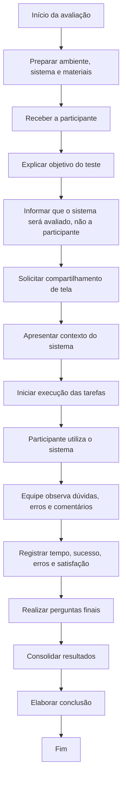

# Aula 14 — Avaliação de Usabilidade por Observação do Usuário

## 1. Método de Avaliação de Usabilidade por Observação do Usuário

O método utilizado foi a **avaliação de usabilidade por observação do usuário**, na qual a participante utilizou o sistema enquanto a equipe observou suas ações, dúvidas, comentários, dificuldades e reações durante a execução de tarefas.

A avaliação teve como objetivo observar situações reais de uso do **Goriah**, identificando problemas de interação, dificuldades de navegação, dúvidas de compreensão e pontos positivos da interface.

Durante o teste, a participante foi orientada a usar o sistema da forma mais natural possível. A equipe evitou explicar diretamente como realizar as tarefas, buscando compreender se a interface era clara o suficiente para guiar a usuária.

---

## 2. Fluxograma de Avaliação de Usabilidade por Observação do Usuário

---

## 3. Descrição do Procedimento de Preparação do Teste

### Passo 1 — Definir o objetivo do teste

O objetivo do teste foi avaliar a usabilidade do **Goriah**, observando se a participante conseguia compreender a proposta da plataforma, navegar pelo sistema, interagir com publicações, acessar o perfil, criar uma publicação, utilizar filtros e localizar informações de ajuda.

A avaliação buscou identificar problemas de interação, dúvidas, pontos de confusão, pontos positivos e oportunidades de melhoria na interface.

---

### Passo 2 — Lista de tarefas que a usuária deveria cumprir

| Nº | Tarefa | Objetivo da tarefa |
|---|---|---|
| 1 | Realizar o cadastro e selecionar interesses. | Verificar se a usuária consegue iniciar o uso do sistema e compreender a seleção inicial de interesses. |
| 2 | Interagir com uma publicação no feed. | Avaliar se a usuária entende as ações disponíveis no feed, como visualizar, curtir ou comentar. |
| 3 | Acessar o perfil e tentar alterar/adicionar foto. | Verificar se a área de perfil é fácil de localizar e editar. |
| 4 | Criar uma nova publicação. | Avaliar se a usuária compreende o fluxo de criação de conteúdo. |
| 5 | Filtrar ou buscar publicações no feed. | Verificar se a usuária consegue localizar conteúdos específicos. |
| 6 | Acessar configurações/ajuda e localizar uma dúvida. | Avaliar se a usuária consegue encontrar informações de apoio dentro do sistema. |

---

### Passo 3 — Formulário de perfil do usuário

| Campo | Resposta |
|---|---|
| Nome ou identificação | Juliana |
| Perfil geral | Usuária externa convidada para testar o sistema |
| Familiaridade com redes sociais | Alta familiaridade percebida durante o teste |
| Familiaridade com sistemas acadêmicos | Não informado |
| Dispositivo utilizado | Computador, com compartilhamento de tela |
| Observação relevante | A participante comparou algumas interações com padrões conhecidos de redes sociais, como Instagram, Facebook e LinkedIn. |

---

### Passo 4 — Cenário apresentado à participante

Antes da execução das tarefas, foi explicado que o **Goriah** é uma plataforma desenvolvida no contexto acadêmico, voltada para estudantes universitários que desejam encontrar publicações, interagir com outros estudantes, acompanhar conteúdos de interesse e compartilhar dúvidas ou oportunidades.

A participante foi orientada a utilizar o sistema da forma mais natural possível e a comentar em voz alta o que achasse fácil, difícil ou confuso.

---

### Passo 5 — Materiais utilizados

| Material | Uso |
|---|---|
| Sistema Goriah | Plataforma avaliada durante o teste. |
| Compartilhamento de tela | Permitiu observar a interação da participante com o sistema. |
| Gravação da reunião | Registro do teste e das respostas da participante. |
| Roteiro de tarefas | Orientou as ações realizadas durante a avaliação. |
| Roteiro de perguntas finais | Coletou a percepção da participante após o uso. |
| Tabela de observação | Utilizada para consolidar sucesso, erros, tempo e satisfação por tarefa. |

---

## 4. Resultados do Teste

### 4.1 Avaliação de cada tarefa — Usuária 1: Juliana

| Tarefa | Grau de Sucesso | Total de Erros cometidos | Tipos de Erros | Tempo Necessário | Grau de Satisfação |
|---|---|---:|---|---|---|
| 1 — Cadastro e seleção de interesses | Sucesso parcial | 2 | Erro de compreensão: dúvida se podia selecionar mais de um interesse. Erro de compreensão: dificuldade com termos técnicos desconhecidos. | Aproximadamente 4min38s | Confusão moderada |
| 2 — Interagir com publicação no feed | Sucesso | 1 | Erro de compreensão: dúvida se precisava apenas interagir ou criar uma publicação. | Aproximadamente 2min06s | Satisfeita |
| 3 — Acessar perfil e tentar colocar foto | Sucesso parcial | 2 | Erro de navegação/compreensão: dificuldade para entender como adicionar foto. Erro de expectativa: esperava upload direto, mas encontrou campo/link. | Aproximadamente 2min28s | Confusão moderada |
| 4 — Criar publicação | Sucesso parcial | 2 | Erro de compreensão: dúvida sobre o tipo de publicação. Erro de preenchimento: confundiu título com corpo da publicação. | Aproximadamente 1min46s | Leve confusão |
| 5 — Filtrar ou buscar no feed | Sucesso | 1 | Erro de compreensão leve: confirmou se deveria inserir uma palavra para buscar. | Aproximadamente 44s | Satisfeita |
| 6 — Acessar configurações/ajuda e localizar dúvida | Sucesso parcial | 1 | Erro de compreensão/navegação: dúvida entre acessar conta, configurações ou ajuda. | Aproximadamente 39s | Leve confusão |

> Os tempos foram estimados com base nos momentos registrados na transcrição da reunião.

---

## 5. Critérios de Avaliação

### 5.1 Grau de sucesso

| Grau de Sucesso | Descrição |
|---|---|
| **Sucesso** | A usuária concluiu a tarefa sem dificuldade relevante. |
| **Sucesso parcial** | A usuária concluiu a tarefa, mas apresentou dúvidas, hesitações ou pequenos erros. |
| **Falha** | A usuária não conseguiu concluir a tarefa. |

---

### 5.2 Tipos de erros observados

| Tipo de Erro | Descrição |
|---|---|
| **Erro de compreensão** | A usuária não entendeu completamente o que deveria fazer ou como interpretar algum elemento da interface. |
| **Erro de navegação** | A usuária teve dificuldade para encontrar uma funcionalidade ou decidir qual caminho seguir. |
| **Erro de preenchimento** | A usuária teve dificuldade ao preencher campos ou interpretar o objetivo de um campo. |
| **Erro de expectativa** | A usuária esperava que uma funcionalidade se comportasse de forma diferente, com base em experiências anteriores em outros sistemas. |

---

### 5.3 Grau de satisfação

| Grau de Satisfação | Descrição |
|---|---|
| **Satisfeita** | A usuária demonstrou facilidade, segurança e percepção positiva durante a tarefa. |
| **Leve confusão** | A usuária teve pequenas dúvidas, mas conseguiu continuar a tarefa. |
| **Confusão moderada** | A usuária demonstrou dificuldade perceptível ou precisou explorar mais até entender o funcionamento. |
| **Insatisfeita** | A usuária demonstrou frustração ou não conseguiu concluir a tarefa. |

---

## 6. Links dos Vídeos

| Usuário | Link do vídeo |
|---|---|
| Usuária 1 — Juliana | [Inserir link do vídeo da gravação] |

---

## 7. Respostas do Formulário do Usuário

### Usuária 1 — Juliana

| Pergunta | Resposta |
|---|---|
| Qual foi sua primeira impressão sobre o sistema? | A participante afirmou que o sistema é bem intuitivo, dinâmico e não muito complexo. Comentou que, após usar mais algumas vezes, a pessoa conseguiria dominar melhor a plataforma. |
| Por que você achou o sistema dessa forma? | Ela explicou que o sistema é mais sucinto e simples, mas assertivo, pois possui o que é necessário. Também comentou que ações como publicar, curtir e comentar lembram redes sociais já conhecidas, como Instagram e Facebook. |
| O que você achou mais fácil? | A parte do feed, principalmente visualizar publicações, curtir e comentar, pois são ações familiares para quem já usa redes sociais. |
| O que você achou mais difícil ou confuso? | A maior dificuldade foi colocar foto no perfil. Ela esperava conseguir inserir uma foto diretamente, mas ficou em dúvida com o funcionamento. |
| Você esperava que alguma coisa funcionasse de outro jeito? | Em geral, não. A participante comentou que o filtro parecia adequado para buscar algo de interesse. |
| O que você melhoraria? | Melhoraria o processo de colocar foto no perfil. |
| Você usaria esse sistema novamente? Por quê? | Sim. Ela afirmou que o sistema faz sentido para quem está estudando, principalmente em períodos de prova ou quando é necessário trocar ideias sobre conteúdos acadêmicos. |
| Comentário adicional | A participante sugeriu a possibilidade de reações diferentes nas publicações, parecidas com as reações existentes no Facebook ou LinkedIn. |
| Comentário sobre seleção de interesses | A participante explicou que ficou um pouco perdida porque alguns assuntos eram muito técnicos e fora da sua área. Também teve dúvida se poderia selecionar mais de um interesse. |
| Comentário sobre criação de publicação | A participante explicou que confundiu o campo de título com o corpo da publicação porque associou o fluxo a redes sociais, onde normalmente se publica diretamente o conteúdo sem separar título e texto. |

---

## 8. Consolidação dos Resultados

| Tarefa | Quantidade de usuários com sucesso | Quantidade de usuários com sucesso parcial | Quantidade de usuários com falha | Principais dificuldades observadas |
|---|---:|---:|---:|---|
| 1 — Cadastro e seleção de interesses | 0 | 1 | 0 | Dúvida sobre seleção múltipla e dificuldade com termos técnicos dos interesses. |
| 2 — Interagir com publicação no feed | 1 | 0 | 0 | Pequena dúvida sobre o que exatamente deveria ser feito na página. |
| 3 — Acessar perfil e tentar colocar foto | 0 | 1 | 0 | Dificuldade para entender como adicionar foto; expectativa de upload direto. |
| 4 — Criar publicação | 0 | 1 | 0 | Dúvida sobre tipo de publicação e confusão entre título e corpo da publicação. |
| 5 — Filtrar ou buscar no feed | 1 | 0 | 0 | Pequena dúvida sobre inserir palavra-chave. |
| 6 — Acessar configurações/ajuda | 0 | 1 | 0 | Dúvida inicial entre conta, configurações e ajuda. |

---

## 9. Principais Problemas Identificados

| Problema identificado | Evidência observada | Gravidade | Sugestão de melhoria |
|---|---|---|---|
| Dúvida sobre seleção múltipla de interesses | A participante perguntou se poderia escolher mais de um interesse. | Média | Inserir uma instrução clara, como “Selecione um ou mais interesses”. |
| Termos técnicos pouco familiares na seleção de interesses | A participante comentou que alguns termos eram desconhecidos por não serem da sua área. | Baixa | Agrupar interesses por área ou inserir nomes mais acessíveis para usuários de diferentes cursos. |
| Dificuldade para colocar foto no perfil | A participante tentou alterar a foto, mas ficou confusa e esperava inserir uma imagem diretamente. | Alta | Permitir upload direto de imagem ou deixar mais claro o formato esperado. |
| Confusão sobre tipo de publicação | Ao criar uma publicação, a participante perguntou o que significava o tipo de publicação. | Média | Adicionar exemplos ou descrições curtas para cada tipo de publicação. |
| Confusão entre título e corpo da publicação | A participante escreveu como se o campo de título fosse o conteúdo principal da publicação. | Média | Reforçar os rótulos dos campos e adicionar placeholders mais explicativos, como “Digite um título curto” e “Escreva o conteúdo da publicação”. |
| Dúvida entre configurações, conta e ajuda | A participante ficou em dúvida sobre onde localizar uma dúvida ou informação de apoio. | Baixa | Melhorar a nomenclatura ou destacar melhor a área de ajuda. |
| Possibilidade de reações mais variadas | A participante sugeriu reações semelhantes às de redes sociais como Facebook e LinkedIn. | Baixa | Avaliar inclusão futura de tipos de reação além de curtir. |

---

## 10. Pontos Positivos Observados

| Ponto positivo | Evidência |
|---|---|
| Interface considerada intuitiva | A participante afirmou que o sistema é bem intuitivo, dinâmico e fácil de dominar com o uso. |
| Familiaridade com padrões de redes sociais | A participante relacionou ações como curtir, comentar e publicar com plataformas conhecidas. |
| Feed fácil de usar | A participante apontou o feed como a parte mais fácil da experiência. |
| Sistema simples e objetivo | A participante comentou que o sistema é simples, sucinto e possui o necessário. |
| Utilidade percebida para estudantes | A participante afirmou que usaria o sistema novamente e que ele faz sentido para estudantes trocarem ideias, especialmente em momentos de estudo ou prova. |
| Página de ajuda considerada explicativa | Ao acessar a área de ajuda, a participante afirmou que estava bem explicativa. |

---

## 11. Conclusão da Avaliação por Observação do Usuário

A avaliação por observação do usuário permitiu identificar que o **Goriah** apresenta uma interface considerada intuitiva e familiar pela participante, especialmente nas ações relacionadas ao feed, como visualizar publicações, curtir e comentar. A semelhança com padrões de redes sociais contribuiu para que a usuária compreendesse rapidamente algumas interações principais.

Apesar da percepção geral positiva, o teste revelou pontos importantes de melhoria. A principal dificuldade ocorreu na tentativa de adicionar foto ao perfil, pois a participante esperava uma ação mais direta, como upload de imagem. Também foram observadas dúvidas na seleção de interesses, especialmente por causa de termos técnicos e pela ausência de uma indicação clara sobre seleção múltipla.

Outro ponto relevante ocorreu na criação de publicação. A participante confundiu o campo de título com o conteúdo principal, pois associou o fluxo ao funcionamento de redes sociais, onde normalmente não há separação clara entre título e corpo da postagem. Isso indica a necessidade de melhorar rótulos, instruções e exemplos nos campos do formulário.

De modo geral, a avaliação mostrou que o sistema atende bem à proposta principal de centralizar interações acadêmicas, publicações e troca de conhecimento. No entanto, alguns ajustes de clareza, feedback e preenchimento podem melhorar a experiência do usuário e reduzir dúvidas durante o uso.

As principais recomendações são: melhorar o fluxo de foto do perfil, inserir instruções mais claras na seleção de interesses, explicar melhor os tipos de publicação, diferenciar com mais clareza os campos de título e conteúdo, e avaliar futuramente a inclusão de reações mais variadas nas publicações.
