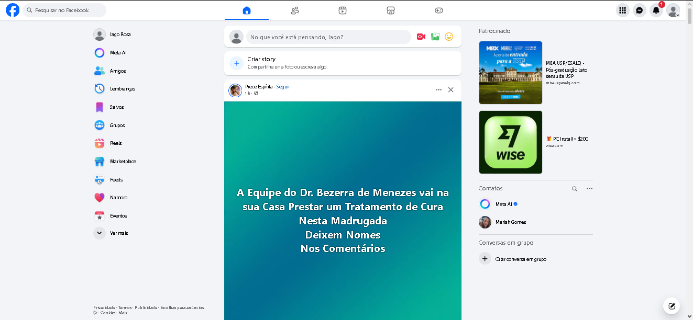
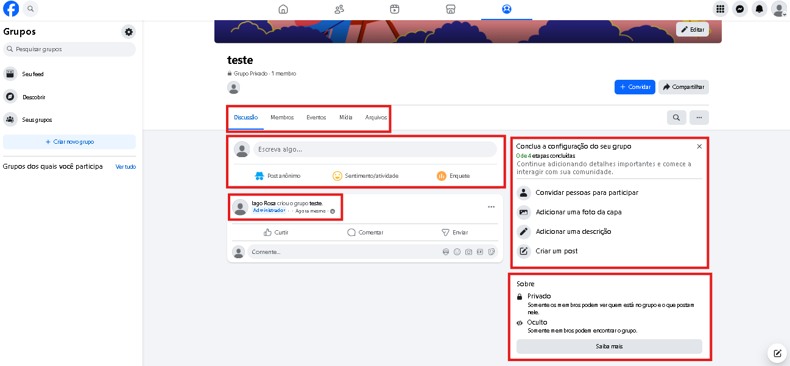
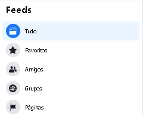
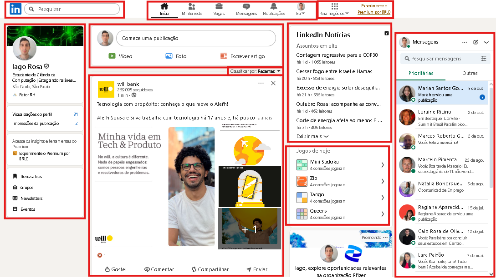

# Aula 2 - Análise de Concorrência

> **NOTE:** O fator mais importante desta entrega é a equipe conseguir identificar e documentar prints de telas de interfaces concorrentes (ou interfaces representativas para o público-alvo).  
> Esses prints serão utilizados nas fases posteriores de caracterização de padrões, affordances, heurísticas, entre outros conceitos de IHC.  
> **Concorrente não é idêntico**, e sim atuante na mesma área e/ou para o mesmo público-alvo.

## 1. Identifique os principais concorrentes mais utilizados pelo seu público-alvo

Com base no público-alvo do projeto (**estudantes universitários**), foram identificadas diferentes plataformas utilizadas para interação social, compartilhamento de conteúdos, networking, comunidades, comunicação e troca de informações.

Durante o desenvolvimento do TCC e do artigo, foi realizado um benchmarking considerando plataformas como Facebook, Instagram, WhatsApp, X (antigo Twitter), LinkedIn, Stack Exchange, Stack Overflow, Reddit, GitHub, GitLab, Moodle, ResearchGate, Academia.edu, Discord, Slack, Advent of Code, Beecrowd, Quora, Brainly, Khan Academy, Medium, Substack e Mastodon.

Também foram consideradas, de forma contextual, plataformas como Canvas, Google Classroom e Microsoft Teams, por sua relação com ambientes acadêmicos e educacionais. No entanto, elas não foram aprofundadas no benchmarking da mesma forma que as demais.

Para o contexto específico desta atividade de IHC, a equipe decidiu aprofundar a análise em duas plataformas:

- Facebook
- LinkedIn

Essa escolha ocorreu porque ambas influenciaram diretamente decisões de interface e interação do Goriah, principalmente em aspectos como feed, perfil de usuário, conexões, publicações, comentários, grupos/comunidades, busca e mecanismos de engajamento.

Essas plataformas não são acadêmicas por essência, porém são amplamente utilizadas pelo público-alvo para interação social, compartilhamento de conteúdo e networking, atuando em áreas próximas ao escopo do projeto.

### 1.1 Facebook

**Link da plataforma:** https://www.facebook.com

### 1.2 LinkedIn

**Link da plataforma:** https://www.linkedin.com

## 2. Descreva as características e funcionalidades de cada concorrente

### 2.1 Facebook

#### Descrição:

O Facebook é uma rede social global lançada em 2004, atualmente pertencente à Meta Platforms. Permite a criação de perfis pessoais, páginas, grupos e o compartilhamento de conteúdos multimídia, além de oferecer um ecossistema de publicidade, métricas e integrações via APIs.

#### Principais funcionalidades:

- Feed de notícias com algoritmo de recomendação
- Criação de grupos públicos e privados
- Salvamento de publicações
- Sistema de amizades e sugestões de conexões
- Publicações em texto, imagem, vídeo, lives e reels
- Ferramentas de métricas e exportação de dados

### 2.2 LinkedIn

#### Descrição:

O LinkedIn é uma rede social profissional fundada em 2002 e adquirida pela Microsoft em 2016. É voltado ao networking profissional, recrutamento, marketing B2B e desenvolvimento de carreira.

#### Principais funcionalidades:

- Perfis profissionais (currículo digital)
- Feed de conteúdo profissional
- Publicação de artigos e documentos
- Sistema de conexões
- Busca e candidatura a vagas
- Cursos online (LinkedIn Learning)

## 3. Colete opiniões sobre a experiência do usuário (UX) de cada concorrente

A análise de UX foi realizada por observação direta das interfaces pelos membros da equipe, considerando critérios como organização visual, facilidade de navegação, clareza das ações principais, quantidade de informações exibidas, estrutura do feed, uso de menus, organização dos perfis e adequação ao público universitário.

Também foram consideradas experiências prévias de uso das plataformas pelos integrantes da equipe, por serem ferramentas conhecidas e utilizadas por parte do público-alvo.

### 3.1 Facebook

#### Opiniões gerais:

- Interface mais simplificada em comparação a versões anteriores
- Design funcional, porém visualmente pouco atrativo
- Organização das funcionalidades pode gerar confusão

#### Pontos positivos:

- Alternância entre diferentes tipos de feed
- Criação e gerenciamento de grupos bem estruturados
- Facilidade de uso para públicos menos familiarizados com tecnologia

#### Pontos negativos:

- Excesso de funcionalidades concentradas na barra lateral
- Organização pouco intuitiva de alguns recursos

### 3.2 LinkedIn

#### Opiniões gerais:

- Interface organizada, porém com excesso de informações no feed
- Design alinhado ao público profissional
- Uso de recursos adicionais para estimular engajamento

#### Pontos positivos:

- Estrutura de perfil bem definida
- Organização consistente do feed
- Recursos que incentivam a permanência do usuário

#### Pontos negativos:

- Feed visualmente carregado
- Grande volume de informações exibidas simultaneamente

## 4. Apresente os preços e modelos de negócio de cada concorrente

### 4.1 Facebook

- Uso gratuito para usuários
- Monetização baseada principalmente em publicidade paga

### 4.2 LinkedIn

- Plano gratuito
- Planos Premium pagos
- Serviços corporativos (Recruiter, Ads, Learning)

## 5. Identifique padrões e tendências no mercado

A partir da análise das plataformas estudadas, foram identificados os seguintes padrões:

- O **feed como página principal** da plataforma
- **Barra de pesquisa posicionada no topo** da interface
- **Menu de navegação para alternância entre páginas** localizado na área superior ou lateral
- **Rolagem contínua de feed (scroll infinito)** como principal forma de consumo de conteúdo
- Valorização de **perfis como identidade digital**
- Predominância de **conteúdos curtos e multimídia**
- Estratégias de **engajamento contínuo**, como notícias, conteúdos recomendados e elementos interativos
- Monetização baseada em **publicidade e planos premium**

Esses padrões aparecem nos prints analisados, especialmente na organização do feed central, na presença de menus de navegação, na valorização do perfil do usuário e nos recursos de interação com publicações. Para o Goriah, esses elementos serviram como referência, mas foram reinterpretados para um contexto acadêmico, com foco na organização e centralização da troca de conhecimentos.

## 6. Elabore relatórios e sumarize os resultados

A análise das plataformas Facebook e LinkedIn permitiu compreender como redes sociais amplamente utilizadas pelo público universitário estruturam seus conteúdos, interfaces e estratégias de engajamento.

Ambas utilizam o feed como elemento central da experiência do usuário, aliado a mecanismos de navegação padronizados, como barra de pesquisa no topo, menu para alternância entre páginas e rolagem contínua de conteúdo. Apesar disso, nenhuma das plataformas possui como objetivo principal a troca estruturada de conhecimento acadêmico ou a resolução colaborativa de problemas.

O Facebook apresenta um conjunto amplo de funcionalidades sociais, enquanto o LinkedIn concentra-se no contexto profissional e de carreira. Em ambos os casos, observa-se que o conhecimento acaba sendo apresentado de forma dispersa e não estruturada.

## 7. Extraia pontos positivos/negativos e faça recomendações.

### Pontos positivos identificados

- Uso do feed como forma central de consumo de conteúdo
- Estrutura clara de navegação entre páginas
- Funcionalidades que incentivam engajamento contínuo
- Perfis como identidade digital do usuário
- Possibilidade de criação de comunidades e grupos

### Pontos negativos identificados

- Excesso de informações exibidas simultaneamente
- Organização de funcionalidades nem sempre intuitiva
- Forte presença de autopromoção e interesses comerciais

### Recomendações

Com base no benchmarking realizado, recomenda-se que a plataforma proposta:

- Utilize o **feed como página principal**, porém com maior controle e organização do conteúdo
- Permita **alternância entre diferentes tipos de feed**, priorizando conteúdos relevantes
- Adote **grupos temáticos ou grupos de estudo** voltados à colaboração acadêmica
- Ofereça **salvamento de publicações** para consulta futura
- Apresente **perfis focados em contribuições acadêmicas**, e não em autopromoção
- Organize funcionalidades de forma mais clara, evitando excesso de elementos simultâneos

Dessa forma, a proposta do projeto busca aproveitar conceitos consolidados das plataformas analisadas, ao mesmo tempo em que se diferencia ao focar na **organização do conhecimento**, na **colaboração estruturada** e no **contexto universitário**.

## 8. Referências consultadas

### Plataformas analisadas em detalhe

- Facebook. Disponível em: https://www.facebook.com
- LinkedIn. Disponível em: https://www.linkedin.com
- Central de Ajuda do Facebook. Disponível em: https://www.facebook.com/help
- LinkedIn Help. Disponível em: https://www.linkedin.com/help/linkedin

### Plataformas consideradas no benchmarking geral do TCC/artigo

- Instagram. Disponível em: https://www.instagram.com
- WhatsApp. Disponível em: https://www.whatsapp.com
- X. Disponível em: https://x.com
- Stack Exchange. Disponível em: https://stackexchange.com
- Stack Overflow. Disponível em: https://stackoverflow.com
- Reddit. Disponível em: https://www.reddit.com
- GitHub. Disponível em: https://github.com
- GitLab. Disponível em: https://gitlab.com
- Moodle. Disponível em: https://moodle.org
- ResearchGate. Disponível em: https://www.researchgate.net
- Academia.edu. Disponível em: https://www.academia.edu
- Discord. Disponível em: https://discord.com
- Slack. Disponível em: https://slack.com
- Advent of Code. Disponível em: https://adventofcode.com
- Beecrowd. Disponível em: https://www.beecrowd.com.br
- Quora. Disponível em: https://www.quora.com
- Brainly. Disponível em: https://brainly.com.br
- Khan Academy. Disponível em: https://pt.khanacademy.org
- Medium. Disponível em: https://medium.com
- Substack. Disponível em: https://substack.com
- Mastodon. Disponível em: https://joinmastodon.org

### Plataformas consideradas de forma contextual

- Canvas. Disponível em: https://www.instructure.com/canvas
- Google Classroom. Disponível em: https://classroom.google.com
- Microsoft Teams. Disponível em: https://www.microsoft.com/microsoft-teams
