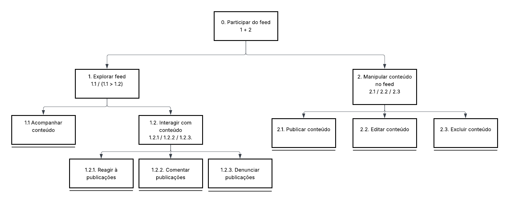
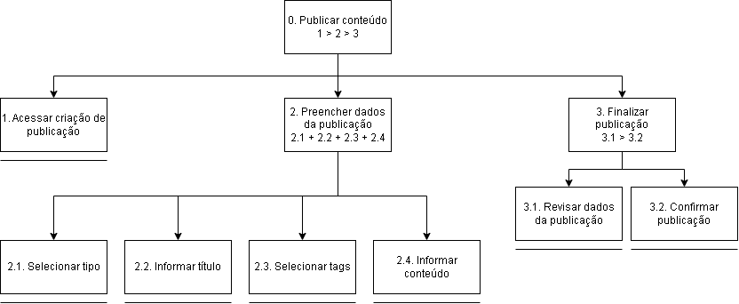
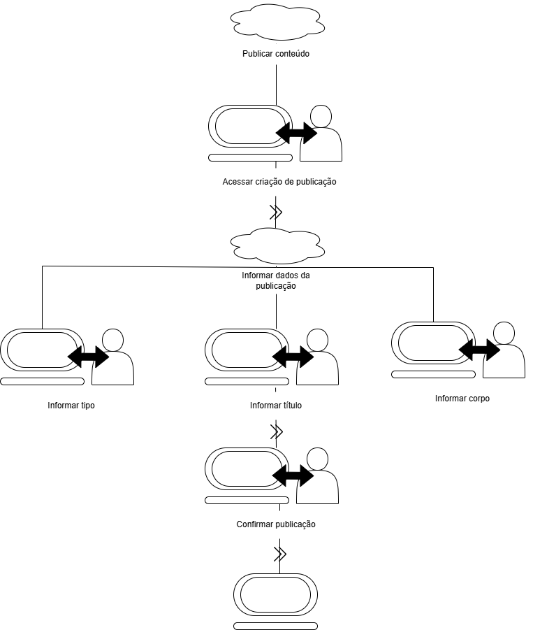

# Organização do Espaço de Problema

## HTA

A HTA (Hierarchical Task Analysis) foi utilizada para decompor tarefas principais da plataforma em objetivos menores, permitindo visualizar quais ações o usuário precisa realizar para completar uma atividade. Nesta etapa, foram modeladas duas funcionalidades centrais do Goriah: participar do feed e publicar conteúdo.

### HTA — Participar do feed

A primeira análise representa a tarefa de participar do feed, uma funcionalidade central do Goriah. Essa tarefa envolve acompanhar publicações, interagir com conteúdos de outros usuários e manipular conteúdos próprios, como publicar, editar ou excluir publicações.

Essa funcionalidade é relevante porque o feed concentra grande parte da troca de conhecimentos acadêmicos, permitindo que estudantes visualizem dúvidas, compartilhem experiências e participem de discussões de forma mais organizada.

| Objetivos/Operações                                                | Problemas e Recomendações                                                                                                                                                                                                                                                                                                                    |
| ------------------------------------------------------------------ | -------------------------------------------------------------------------------------------------------------------------------------------------------------------------------------------------------------------------------------------------------------------------------------------------------------------------------------------- |
| **0. Participar do feed** **Plano:** 1 + 2                      | **Input:** feed com publicações disponíveis e ações acessíveis ao usuário. **Feedback:** o usuário consegue explorar o feed, interagir com conteúdos e manipular conteúdos próprios. **Plano:** explorar o feed e/ou manipular conteúdo no feed. **Recomendação:** manter navegação clara e ações principais visíveis na interface. |
| **1. Explorar feed** **Plano:** 1.1 / (1.1 > 1.2)               | **Plano:** acompanhar conteúdos do feed e, quando desejado, interagir com eles.                                                                                                                                                                                                                                                              |
| **1.1 Acompanhar conteúdo**                                        | **Problema:** o usuário pode ter dificuldade para acompanhar as publicações caso o feed não seja organizado ou legível. **Recomendação:** apresentar os conteúdos com hierarquia visual clara e navegação fluida.                                                                                                                         |
| **1.2 Interagir com conteúdo** **Plano:** 1.2.1 / 1.2.2 / 1.2.3 | **Plano:** permitir ao usuário reagir, comentar ou denunciar publicações conforme sua necessidade.                                                                                                                                                                                                                                           |
| **1.2.1 Reagir a publicações**                                     | **Problema:** o usuário pode não perceber facilmente a possibilidade de reagir ou não compreender o efeito da ação. **Recomendação:** exibir o botão de reação de forma visível e fornecer retorno imediato após a interação.                                                                                                             |
| **1.2.2 Comentar publicações**                                     | **Problema:** campos de comentário pouco evidentes ou com fluxo confuso podem dificultar a participação textual do usuário. **Recomendação:** facilitar a abertura da área de comentários e apresentar feedback claro após o envio.                                                                                                       |
| **1.2.3 Denunciar publicações**                                    | **Problema:** se o processo de denúncia for pouco claro, o usuário pode desistir de reportar conteúdos inadequados. **Recomendação:** manter o fluxo de denúncia simples, com seleção objetiva do motivo e confirmação da ação realizada.                                                                                                 |
| **2. Manipular conteúdo no feed** **Plano:** 2.1 / 2.2 / 2.3    | **Plano:** permitir ao usuário publicar, editar ou excluir conteúdos de sua autoria no feed.                                                                                                                                                                                                                                                 |
| **2.1 Publicar conteúdo**                                          | **Problema:** um fluxo confuso ou excessivamente longo pode dificultar a criação de publicações. **Recomendação:** simplificar a criação de conteúdo, destacando campos obrigatórios e o botão de publicar.                                                                                                                               |
| **2.2 Editar conteúdo**                                            | **Problema:** o usuário pode não perceber como alterar uma publicação já criada ou ter receio de perder informações. **Recomendação:** permitir edição de forma acessível, com conteúdo previamente carregado e confirmação após salvar.                                                                                                  |
| **2.3 Excluir conteúdo**                                           | **Problema:** a exclusão acidental de uma publicação pode gerar perda de conteúdo relevante. **Recomendação:** solicitar confirmação antes de excluir e apresentar feedback após a remoção.                                                                                                                                               |

### HTA — Publicar conteúdo

A segunda análise representa a tarefa de publicar conteúdo no feed. Essa funcionalidade foi detalhada separadamente porque a criação de publicações é uma ação essencial para a proposta do Goriah, permitindo que estudantes compartilhem dúvidas, soluções, experiências, materiais e informações acadêmicas.

A tarefa foi decomposta em acesso à criação da publicação, preenchimento dos dados obrigatórios e finalização da publicação. Essa divisão ajuda a identificar quais campos precisam estar claros para o usuário e quais validações devem ser comunicadas antes da confirmação.

| Objetivos/Operações                                                      | Problemas e Recomendações                                                                                                                                                                                                                                                                                                                           |
| ------------------------------------------------------------------------ | --------------------------------------------------------------------------------------------------------------------------------------------------------------------------------------------------------------------------------------------------------------------------------------------------------------------------------------------------- |
| **0. Publicar conteúdo** **Plano:** 1 > 2 > 3                         | **Input:** intenção do usuário de criar uma publicação acadêmica no feed. **Feedback:** publicação criada e exibida no feed após confirmação. **Plano:** acessar a criação, preencher os dados obrigatórios e finalizar a publicação. **Recomendação:** apresentar um fluxo direto, com campos bem identificados e feedback após publicar. |
| **1. Acessar criação de publicação**                                     | **Problema:** o usuário pode não perceber onde iniciar uma nova publicação. **Recomendação:** manter o botão ou campo de criação de publicação em posição visível no feed.                                                                                                                                                                       |
| **2. Preencher dados da publicação** **Plano:** 2.1 + 2.2 + 2.3 + 2.4 | **Plano:** preencher os dados necessários para que a publicação tenha contexto, tema e conteúdo compreensível.                                                                                                                                                                                                                                      |
| **2.1 Selecionar tipo**                                                  | **Problema:** o usuário pode não entender a diferença entre os tipos de publicação. **Recomendação:** nomear os tipos de forma clara e, se necessário, apresentar uma breve orientação.                                                                                                                                                          |
| **2.2 Informar título**                                                  | **Problema:** títulos genéricos dificultam a compreensão rápida do conteúdo. **Recomendação:** orientar o usuário a escrever um título objetivo e relacionado ao assunto da publicação.                                                                                                                                                          |
| **2.3 Selecionar tags**                                                  | **Problema:** a ausência de tags ou o uso de tags pouco relacionadas pode dificultar a busca e a organização do conteúdo. **Recomendação:** exigir de 1 a 5 tags e sugerir tags relacionadas aos interesses ou ao conteúdo da publicação.                                                                                                        |
| **2.4 Informar conteúdo**                                                | **Problema:** o usuário pode não saber o nível de detalhe esperado no corpo da publicação. **Recomendação:** permitir texto claro e suficiente para explicar dúvida, solução, experiência ou informação acadêmica.                                                                                                                               |
| **3. Finalizar publicação** **Plano:** 3.1 > 3.2                      | **Plano:** revisar os dados preenchidos e confirmar o envio da publicação.                                                                                                                                                                                                                                                                          |
| **3.1 Revisar dados da publicação**                                      | **Problema:** erros de preenchimento podem passar despercebidos antes da publicação. **Recomendação:** permitir que o usuário revise tipo, título, tags e conteúdo antes de confirmar.                                                                                                                                                           |
| **3.2 Confirmar publicação**                                             | **Problema:** ausência de retorno pode deixar o usuário inseguro se a publicação foi enviada. **Recomendação:** exibir confirmação de sucesso e redirecionar ou atualizar o feed com a publicação criada.                                                                                                                                        |

## GOMS

O modelo GOMS foi utilizado para detalhar como o usuário pode atingir os objetivos definidos na análise de tarefas. Ele organiza a interação em objetivos, métodos, operações e regras de seleção, permitindo identificar diferentes caminhos possíveis para concluir uma mesma tarefa.

No Goriah, essa análise é importante porque ajuda a compreender como os usuários acessam, filtram, buscam, interagem e publicam conteúdos acadêmicos no feed. Além disso, permite observar pontos em que a interface deve oferecer clareza, feedback e alternativas de interação.

### Goal 0: Participar do feed

- **Goal 1: Explorar o feed**
  - **Goal 1.1: Acompanhar conteúdo**
    - **Method 1.1.A: Navegar pelo feed rolando a tela**
    - **Selection Rule:** usar este método quando o usuário não tiver preferência por um conteúdo específico e quiser apenas acompanhar as publicações disponíveis.
      - **OP. 1.1.A.1:** visualizar a tela inicial do feed
      - **OP. 1.1.A.2:** identificar as publicações exibidas
      - **OP. 1.1.A.3:** rolar a tela para visualizar mais conteúdos
    - **Method 1.1.B: Filtrar conteúdo por tags**
    - **Selection Rule:** usar este método quando o usuário tiver interesse em conteúdos de um assunto específico e houver publicações associadas às tags desejadas.
      - **OP. 1.1.B.1:** visualizar a tela inicial do feed
      - **OP. 1.1.B.2:** clicar no botão **Filtrar**
      - **OP. 1.1.B.3:** buscar a(s) tag(s) desejada(s), selecioná-la(s) e clicar em **Aplicar**
      - **OP. 1.1.B.4:** visualizar a tela do feed filtrada com a(s) tag(s) utilizada(s)
    - **Method 1.1.C: Buscar conteúdo pelo campo de busca**
    - **Selection Rule:** usar este método quando o usuário quiser localizar uma publicação ou assunto específico.
      - **OP. 1.1.C.1:** visualizar a tela inicial do feed
      - **OP. 1.1.C.2:** clicar no campo de busca para ativar a escrita
      - **OP. 1.1.C.3:** escrever palavras-chave do conteúdo desejado
      - **OP. 1.1.C.4:** visualizar a tela do feed com conteúdos que possuam as palavras-chave informadas

  - **Goal 1.2: Interagir com conteúdo**
    - **Method 1.2.1.A: Reagir a publicações**
    - **Selection Rule:** usar este método quando o usuário quiser expressar uma reação rápida a uma publicação sem adicionar um comentário.
      - **OP. 1.2.1.A.1:** visualizar a publicação desejada no feed
      - **OP. 1.2.1.A.2:** identificar o botão de reação da publicação
      - **OP. 1.2.1.A.3:** clicar no botão de reação desejado
      - **OP. 1.2.1.A.4:** visualizar a reação aplicada à publicação

    - **Method 1.2.2.A: Comentar publicações**
    - **Selection Rule:** usar este método quando o usuário quiser se manifestar de forma textual sobre uma publicação.
      - **OP. 1.2.2.A.1:** visualizar a publicação desejada no feed
      - **OP. 1.2.2.A.2:** identificar e clicar na opção de comentar
      - **OP. 1.2.2.A.3:** visualizar o campo de comentário
      - **OP. 1.2.2.A.4:** escrever o comentário desejado
      - **OP. 1.2.2.A.5:** clicar no botão para enviar o comentário
      - **OP. 1.2.2.A.6:** visualizar o comentário publicado na publicação

    - **Method 1.2.3.A: Denunciar publicações**
    - **Selection Rule:** usar este método quando o usuário identificar uma publicação inadequada e quiser reportá-la.
      - **OP. 1.2.3.A.1:** visualizar a publicação desejada no feed
      - **OP. 1.2.3.A.2:** identificar e clicar no menu de opções da publicação
      - **OP. 1.2.3.A.3:** selecionar a opção **Denunciar**
      - **OP. 1.2.3.A.4:** visualizar a tela ou modal de denúncia
      - **OP. 1.2.3.A.5:** selecionar o motivo da denúncia
      - **OP. 1.2.3.A.6:** clicar no botão para confirmar a denúncia
      - **OP. 1.2.3.A.7:** visualizar a confirmação do envio da denúncia

- **Goal 2: Manipular conteúdo no feed**
  - **Goal 2.1: Publicar conteúdo**
    - **Method 2.1.A: Criar uma nova publicação**
    - **Selection Rule:** usar este método quando o usuário quiser compartilhar um novo conteúdo no feed.
      - **OP. 2.1.A.1:** visualizar a tela inicial do feed
      - **OP. 2.1.A.2:** identificar e clicar no botão de criar publicação
      - **OP. 2.1.A.3:** visualizar a tela de criação de publicação
      - **OP. 2.1.A.4:** preencher os campos obrigatórios
      - **OP. 2.1.A.5:** clicar no botão **Publicar**
      - **OP. 2.1.A.6:** visualizar a publicação criada no feed

  - **Goal 2.2: Editar conteúdo**
    - **Method 2.2.A: Editar uma publicação existente**
    - **Selection Rule:** usar este método quando o usuário quiser alterar informações de uma publicação já criada.
      - **OP. 2.2.A.1:** visualizar uma publicação de sua autoria no feed
      - **OP. 2.2.A.2:** identificar e clicar no menu de opções da publicação
      - **OP. 2.2.A.3:** selecionar a opção **Editar**
      - **OP. 2.2.A.4:** visualizar a tela de edição da publicação
      - **OP. 2.2.A.5:** alterar o conteúdo desejado
      - **OP. 2.2.A.6:** clicar no botão para salvar as alterações
      - **OP. 2.2.A.7:** visualizar a publicação atualizada no feed

  - **Goal 2.3: Excluir conteúdo**
    - **Method 2.3.A: Excluir uma publicação existente**
    - **Selection Rule:** usar este método quando o usuário quiser remover do feed uma publicação de sua autoria.
      - **OP. 2.3.A.1:** visualizar uma publicação de sua autoria no feed
      - **OP. 2.3.A.2:** identificar e clicar no menu de opções da publicação
      - **OP. 2.3.A.3:** selecionar a opção **Excluir**
      - **OP. 2.3.A.4:** visualizar a mensagem de confirmação da exclusão
      - **OP. 2.3.A.5:** clicar no botão para confirmar a exclusão
      - **OP. 2.3.A.6:** visualizar o feed sem a publicação excluída

### Goal 0: Publicar conteúdo

- **Goal 1: Acessar criação de publicação**
  - **Method 1.A: Acessar pelo botão de criação**
  - **Selection Rule:** usar este método quando o usuário estiver no feed e quiser iniciar uma nova publicação.
    - **OP. 1.A.1:** visualizar a tela inicial do feed
    - **OP. 1.A.2:** identificar o botão ou campo de criação de publicação
    - **OP. 1.A.3:** clicar no botão ou campo de criação
    - **OP. 1.A.4:** visualizar a tela ou área de criação de publicação

- **Goal 2: Preencher dados da publicação**
  - **Goal 2.1: Selecionar tipo**
    - **Method 2.1.A: Selecionar tipo da publicação**
    - **Selection Rule:** usar este método quando o usuário precisar indicar a natureza do conteúdo que será publicado.
      - **OP. 2.1.A.1:** visualizar as opções de tipo da publicação
      - **OP. 2.1.A.2:** selecionar o tipo desejado
      - **OP. 2.1.A.3:** visualizar o tipo selecionado

  - **Goal 2.2: Informar título**
    - **Method 2.2.A: Digitar título**
    - **Selection Rule:** usar este método quando o usuário precisar identificar o assunto principal da publicação.
      - **OP. 2.2.A.1:** clicar no campo de título
      - **OP. 2.2.A.2:** digitar um título objetivo para a publicação
      - **OP. 2.2.A.3:** visualizar o título preenchido

  - **Goal 2.3: Selecionar tags**
    - **Method 2.3.A: Pesquisar e selecionar tags**
    - **Selection Rule:** usar este método quando o usuário souber qual tag deseja usar ou quiser localizar uma tag específica.
      - **OP. 2.3.A.1:** clicar no campo de busca de tags
      - **OP. 2.3.A.2:** digitar o nome ou parte do nome da tag desejada
      - **OP. 2.3.A.3:** visualizar as tags correspondentes à busca
      - **OP. 2.3.A.4:** selecionar uma ou mais tags relacionadas à publicação
      - **OP. 2.3.A.5:** visualizar as tags selecionadas

    - **Method 2.3.B: Selecionar tags recomendadas**
    - **Selection Rule:** usar este método quando o usuário quiser escolher rapidamente entre tags sugeridas pela plataforma.
      - **OP. 2.3.B.1:** visualizar a lista de tags recomendadas
      - **OP. 2.3.B.2:** identificar tags relacionadas ao conteúdo da publicação
      - **OP. 2.3.B.3:** selecionar uma ou mais tags recomendadas
      - **OP. 2.3.B.4:** visualizar as tags selecionadas

    - **Selection Rule geral:** a publicação deve conter pelo menos 1 tag e no máximo 5 tags.

  - **Goal 2.4: Informar conteúdo**
    - **Method 2.4.A: Digitar corpo da publicação**
    - **Selection Rule:** usar este método quando o usuário precisar escrever a dúvida, solução, experiência ou informação acadêmica que deseja compartilhar.
      - **OP. 2.4.A.1:** clicar no campo de conteúdo
      - **OP. 2.4.A.2:** digitar o corpo da publicação
      - **OP. 2.4.A.3:** revisar visualmente o conteúdo preenchido

- **Goal 3: Finalizar publicação**
  - **Goal 3.1: Revisar dados da publicação**
    - **Method 3.1.A: Conferir informações preenchidas**
    - **Selection Rule:** usar este método antes de publicar, principalmente quando o usuário quiser evitar erros de tipo, título, tags ou conteúdo.
      - **OP. 3.1.A.1:** verificar o tipo selecionado
      - **OP. 3.1.A.2:** verificar o título informado
      - **OP. 3.1.A.3:** verificar as tags selecionadas
      - **OP. 3.1.A.4:** verificar o conteúdo escrito

  - **Goal 3.2: Confirmar publicação**
    - **Method 3.2.A: Publicar clicando no botão**
    - **Selection Rule:** usar este método quando o usuário quiser finalizar a publicação por meio do botão visível na interface.
      - **OP. 3.2.A.1:** identificar o botão **Publicar**
      - **OP. 3.2.A.2:** clicar no botão **Publicar**
      - **OP. 3.2.A.3:** visualizar a confirmação da publicação
      - **OP. 3.2.A.4:** visualizar a publicação criada no feed

    - **Method 3.2.B: Publicar pressionando Enter**
    - **Selection Rule:** usar este método quando o usuário estiver com o foco no campo de texto e quiser concluir a publicação por atalho de teclado permitido pela interface.
      - **OP. 3.2.B.1:** manter o foco no campo de texto ou área de criação
      - **OP. 3.2.B.2:** pressionar a tecla **Enter**
      - **OP. 3.2.B.3:** visualizar a confirmação da publicação
      - **OP. 3.2.B.4:** visualizar a publicação criada no feed

## CTT

